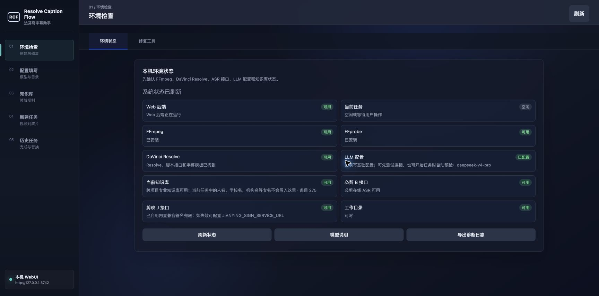
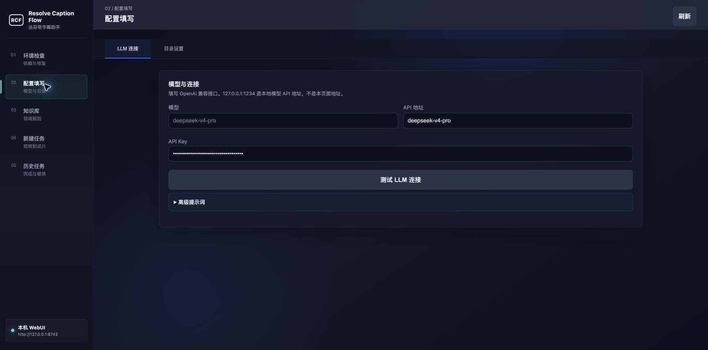
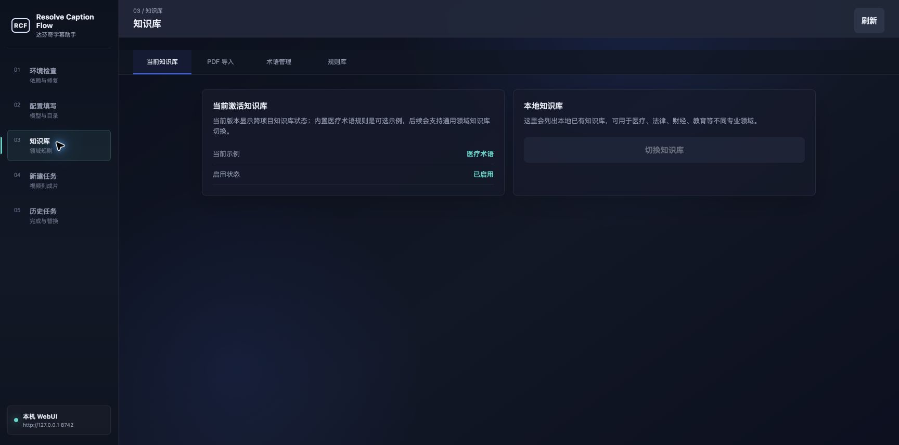
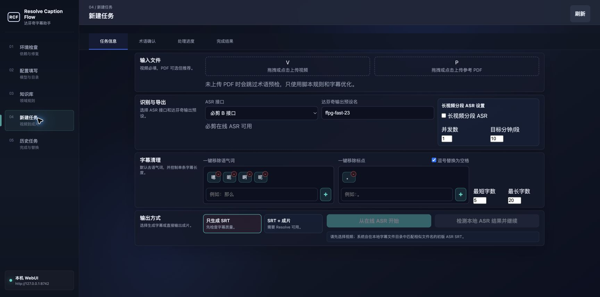
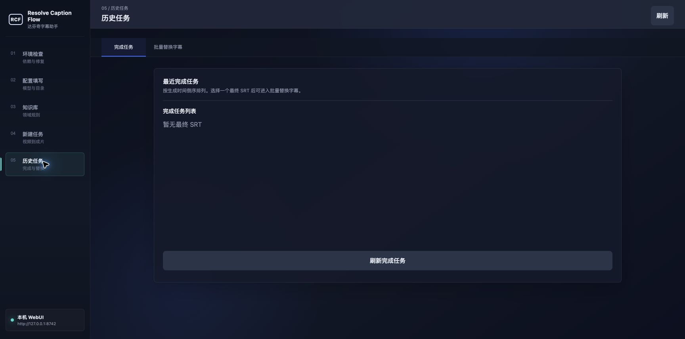

# 达芬奇字幕助手

面向专业长视频的本地字幕校对和成片交付工具：从在线音频 ASR 转写开始，经过术语校对、字幕清理，再按 DaVinci Resolve 模板输出最终成片。

## 项目特点

- **面向长视频字幕校对**：支持在线视频 ASR、术语提取与审核、字幕断句和清理，并保留中间 SRT 以便继续处理。
- **第三方 ASR 服务配额**：当前使用的第三方 ASR 服务在每个网络环境下通常有每日约 **5 小时**的使用配额。这是服务方的配额限制，不是本项目的设计限制；请按服务允许的方式分批处理，或向服务方申请更高配额。
- **大语言模型校对**：可结合参考 PDF、术语表和模型配置进行术语审核与字幕文本校对；医学课程资料是可选示例之一。
- **本地知识库**：可在 WebUI 中维护项目或领域术语知识库，供后续任务复用；当前内置规则以医疗术语为示例，并非唯一适用领域。
- **Resolve 最终交付**：将最终 SRT 导入带有字幕样式的 DaVinci Resolve 模板工程，并调用本机渲染预设输出成片。
- **本地数据边界**：视频、SRT、日志、API Key、模型配置和本地知识库均不上传 GitHub，也不会被打进用户发布包。

## 界面预览











## 使用手册

### 1. 启动项目

#### macOS

双击：

```text
start_web.command
```

首次双击若被 macOS 拦截，请进入“系统设置 → 隐私与安全性”，在“安全性”区域点击“仍要打开”，再使用密码或 Touch ID 验证后打开。

也可以在终端手动运行：

```bash
python3 app/web_server.py --host 127.0.0.1 --port 8742
```

#### Windows

双击：

```text
start_web.bat
```

首次启动会创建项目根目录下的 `.venv`，并安装 `requirements.txt` 中的 Python 依赖。首次运行（或尚未保存镜像选择时）脚本会询问是否使用清华 PyPI 镜像：选择“是”使用镜像，选择“否”继续使用官方 PyPI；该选择只保存在本机 `.venv` 内，之后会自动沿用，不会每次启动重复询问。完成后会自动打开浏览器。命令窗口保持打开期间 WebUI 会持续运行，按 Ctrl+C 即可停止服务。

也可以在命令提示符或 PowerShell 中手动运行：

```bash
python app/web_server.py --host 127.0.0.1 --port 8742
```

然后访问：

```text
http://127.0.0.1:8742/
```

### 2. 安装或检查 FFmpeg

项目需要 `ffmpeg` 和 `ffprobe` 用于视频探测、音频提取和渲染校验。启动时会自动检查；也可在终端执行：

```bash
ffmpeg -version
ffprobe -version
```

#### macOS

若未安装且使用 Homebrew，可执行：

```bash
brew install ffmpeg
```

#### Windows

可使用已安装的软件包管理器安装：`winget install Gyan.FFmpeg`、`choco install ffmpeg` 或 `scoop install ffmpeg`。若这些工具均不可用，请从可信 FFmpeg 发行包下载，解压后将其 `bin` 目录加入系统 `PATH`，再重新打开终端确认 `ffmpeg -version` 和 `ffprobe -version` 均可用。

### 3. 完成首次配置

在“配置填写”页面填写模型名称、API 地址和 API Key，并按需要设置字幕清理选项与“达芬奇输出预设名”。

这些本地配置保存在 `data/work/web_config.json`；其中的 API Key、模型配置和本地知识库均被 Git 忽略，也会被用户发布包排除。可参考不含密钥的 [`resources/web_config.example.json`](resources/web_config.example.json)。

### 4. 准备知识库

在“知识库”页面导入或维护术语资料。知识库只保存在本机，位于 `data/work/knowledge_base/`，不会上传到 GitHub，也不会随用户发布包分发。

### 5. 创建任务

在“新建任务”页面选择视频；如有参考 PDF，也可一并上传以提取和审核术语。选择在线 ASR 接口后，可按需要启用长视频分段处理并设置字幕清理规则。

选择“只生成 SRT”可先检查最终字幕；选择“SRT + 成片”会继续进入 DaVinci Resolve 导入和渲染阶段。第三方 ASR 的每日配额不足时，请按服务允许的方式分批处理或申请更高配额。

### 6. 生成成片前的 DaVinci Resolve 准备

以下准备仅在选择“SRT + 成片”时需要；仅生成 SRT 不需要安装或打开 DaVinci Resolve。

1. 在本机安装并打开 DaVinci Resolve，并在偏好设置中启用 `External scripting: Local`（本地外部脚本权限）。
2. 在 DaVinci Resolve 中制作包含目标字幕样式的模板工程，保存为 `sub.drp`，并放入项目的 `resources/` 目录。程序固定读取 `resources/sub.drp`。
3. 在本机 DaVinci Resolve 中保存需要使用的渲染预设，并在项目界面的“达芬奇输出预设名”中填写该预设名称。最终成片导出会调用该预设。

#### 推荐：安装 FFmpeg Encoder Plugin（可选）

如需在 DaVinci Resolve Studio 中使用 FFmpeg 的 H.264、H.265 或 AV1 编码器，推荐安装 [EdvinNilsson/ffmpeg_encoder_plugin](https://github.com/EdvinNilsson/ffmpeg_encoder_plugin)。该插件为可选增强项；本项目的字幕处理不依赖它，但它可为成片导出提供更多编码器选择。

##### macOS 安装步骤

1. 从该项目的 [最新发布包](https://github.com/EdvinNilsson/ffmpeg_encoder_plugin/releases/latest/download/ffmpeg_encoder_plugin.dvcp.bundle.zip) 下载 `ffmpeg_encoder_plugin.dvcp.bundle.zip`，并解压。
2. 在“终端”中执行下列命令，移除 macOS 对该未公证插件的隔离标记：

   ```bash
   xattr -rd com.apple.quarantine ffmpeg_encoder_plugin.dvcp.bundle
   ```

3. 将 `ffmpeg_encoder_plugin.dvcp.bundle` 移至对应目录：独立安装版 DaVinci Resolve 使用 `/Library/Application Support/Blackmagic Design/DaVinci Resolve/IOPlugins/`；Mac App Store 版使用 `~/Library/Containers/com.blackmagic-design.DaVinciResolveAppStore/Data/Library/Application Support/IOPlugins/`。
4. 完全关闭并重新启动 DaVinci Resolve Studio；随后在交付页面的编码器选项中确认新增的 FFmpeg 编码器。

##### Windows 安装步骤

1. 从该项目的 [最新发布包](https://github.com/EdvinNilsson/ffmpeg_encoder_plugin/releases/latest/download/ffmpeg_encoder_plugin.dvcp.bundle.zip) 下载 `ffmpeg_encoder_plugin.dvcp.bundle.zip`。
2. 解压压缩包，将解压得到的 `ffmpeg_encoder_plugin.dvcp.bundle` 文件夹复制到 `%ProgramData%\Blackmagic Design\DaVinci Resolve\Support\IOPlugins\`。如目标目录不存在，可自行创建。
3. 完全关闭并重新启动 DaVinci Resolve Studio；随后在交付页面的编码器选项中确认新增的 FFmpeg 编码器。

插件的版本兼容性、许可和故障排查以其 [官方说明](https://github.com/EdvinNilsson/ffmpeg_encoder_plugin#readme) 为准。

### 7. 查看最终输出

- 最终 SRT、处理中间文件和报告保存在 `data/work/`。
- 任务日志保存在 `data/logs/`。
- 成片输出保存在 `data/output/`；文件名默认使用原视频文件名主干加“字幕版”。
- 可在“历史任务”页面查看任务状态，并继续使用已有字幕结果。

## 项目目录

```text
app/            WebUI 和本地服务
pipeline/       字幕生产、术语和校对流程
integrations/   在线 ASR 等外部服务适配
caption_core/   可复用领域模型与基础能力
resources/      Resolve 模板、字幕样式说明和示例资源
data/           本地输入、工作文件、输出、日志和知识库
docs/           流程与技术文档
tests/          自动化测试
scripts/        辅助脚本
```

## 开源协议

本项目采用 [MIT License](LICENSE)。
